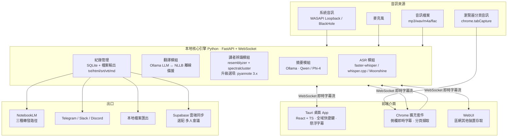

# 翻譯蒟蒻 — 多功能即時語音紀錄工具 系統規劃書

> 即時轉錄翻譯、離線音訊處理、講者辨識、AI 摘要,一套搞定,並轉發 NotebookLM
> 版本:v0.1(規劃階段)|日期:2026-07-13

---

## 一、三個參考專案整合分析

### 1. jt-live-whisper(Jason Cheng / Apache 2.0)
**定位:本專案的「核心引擎」來源**

100% 全地端 AI 語音工具集,功能最完整:

| 功能 | 實作方式 |
|------|----------|
| 即時語音辨識 | whisper.cpp / faster-whisper / mlx-whisper(中日英,GPU 加速) |
| 低延遲辨識 | Moonshine(約 300ms,英文專用) |
| 即時翻譯 | 本地 Ollama LLM(Qwen / Phi-4);離線備援 NLLB 600M / Argos |
| 講者辨識 | resemblyzer 聲紋特徵 + spectralcluster 頻譜分群 |
| AI 摘要 | 本地 LLM 生成會議重點 + 校正逐字稿 |
| 離線批次處理 | mp3 / wav / m4a / flac 批次轉錄 |
| 音訊擷取 | macOS:BlackHole 虛擬音訊;Windows:WASAPI Loopback |
| 輸出格式 | txt / 互動式 HTML / srt / vtt / 摘要 HTML |
| 部署模式 | 單機 或 本機擷取 + 遠端 GPU 伺服器(快 5-10 倍) |
| 額外特色 | 懸浮字幕、關鍵字通知、字幕轉發 Telegram/Slack/Discord、WebUI |

**採用**:整個 ASR / 翻譯 / 講者辨識 / 摘要管線、雙平台音訊擷取方案、GPU 伺服器架構、輸出格式。
**不足**:無桌面 App 包裝(Python 腳本 + WebUI)、無 Chrome 擴充、字幕轉發不含 NotebookLM。

### 2. GPT-Typeless(cablate / MIT)
**定位:「桌面殼層與使用者體驗」範本**

Tauri 2.x 桌面應用(React 19 + TypeScript 前端、Rust 後端):

| 特點 | 技術 |
|------|------|
| 一鍵錄音、鬆開即轉錄 | Rust `cpal` 音訊錄製 |
| 全域快捷鍵(Ctrl+Shift+R) | `global-hotkey` |
| 自動複製到剪貼簿 | `arboard` |
| 隱私優先 | 音檔本地存放、7 天自動清理 |
| 歷史紀錄 | 最近 5 筆轉錄結果 |
| 輕量安裝包 | Tauri 打包(遠小於 Electron) |

**採用**:Tauri 桌面架構、全域快捷鍵、剪貼簿整合、本地隱私與自動清理策略、緊湊 UI 設計。
**不足/替換**:它呼叫 ChatGPT 網頁版 Token 做轉錄(非正式 API,有失效風險)→ 改接本地 Whisper 引擎;無翻譯、講者辨識、摘要。

### 3. meeting-APP(jcservice999)
**定位:「Web 協作層與瀏覽器端」範本**

純前端(HTML/CSS/JS)+ Supabase 免費後端的多人會議字幕應用:

| 特點 | 實作方式 |
|------|----------|
| 混合辨識 | Web Speech API(即時、零安裝)+ Whisper(高準確度) |
| 多人即時字幕同步 | Supabase Realtime |
| 說話者標註 | 依登入身分自動標註 + 發言視覺提示 |
| 權限管理 | Google OAuth、管理員審核機制 |
| 會議紀錄 | 完整歷史 + 時間戳記(Supabase 500MB DB / 1GB 儲存) |
| 零成本部署 | GitHub Pages + Supabase 免費方案 |

**採用**:Web Speech API 作為瀏覽器端「零安裝即時預覽」、Supabase 多人同步與雲端紀錄(選配)、Google OAuth 身分即講者標註的思路。
**不足**:辨識品質受限瀏覽器、無翻譯/摘要/檔案處理、講者標註靠帳號而非聲紋。

### 整合結論:三專案互補關係

```
jt-live-whisper  →  AI 能力層(辨識/翻譯/聲紋講者辨識/摘要/離線批次)
GPT-Typeless     →  桌面體驗層(Tauri 殼、快捷鍵、剪貼簿、隱私策略)
meeting-APP      →  瀏覽器與協作層(Chrome 端即時字幕、多人同步、雲端紀錄)
翻譯蒟蒻          =  三層合一 + NotebookLM 知識庫出口
```

---

## 二、系統總體架構



### 架構決策

1. **核心引擎 = 本地 Python 服務**(以 jt-live-whisper 為基底改造):
   - 用 FastAPI 包成常駐服務,對外提供 REST(任務管理)+ WebSocket(即時字幕流)。
   - 好處:桌面 App、Chrome 擴充、WebUI 三個前端共用同一引擎,不重複實作 AI 管線。
2. **桌面 App = Tauri**(參考 GPT-Typeless):負責音訊擷取授權、全域快捷鍵、懸浮字幕視窗、引擎生命週期管理(開機自動啟動引擎)。
3. **Chrome 擴充 = 輕前端**:不內建 AI,透過 `ws://127.0.0.1` 連本地引擎;引擎不在時降級用 Web Speech API(參考 meeting-APP 的混合模式)。
4. **隱私優先**:預設全地端處理(音訊不出機器);雲端同步(Supabase)與 NotebookLM 轉發皆為使用者主動觸發的選配。

---

## 三、功能模組規格

### 3.1 即時轉錄 + 翻譯
- 音訊來源:系統音訊(會議軟體聲音)、麥克風、或雙向同時(區分「對方」與「我方」字幕)。
- 引擎:faster-whisper(Windows CUDA)/ mlx-whisper(macOS Metal)/ whisper.cpp(CPU 備援);英文低延遲場景可切 Moonshine。
- 翻譯模式:英↔中、日↔中等(沿用 jt-live-whisper 的十種模式);主翻譯走本地 Ollama LLM(可注入「會議主題上下文」提升術語準確度),無 Ollama 時退回 NLLB 離線翻譯。
- 顯示:桌面懸浮字幕(半透明置頂)、Tauri 主視窗雙欄(原文/譯文)、Chrome 側欄。
- 延遲目標:Windows RTX 4060 約 0.5–1 秒;macOS M2 約 1–3 秒(以 jt-live-whisper 實測值為基準)。

### 3.2 離線音訊處理
- 批次匯入 mp3/wav/m4a/flac(拖曳到桌面 App 或 WebUI 上傳)。
- 輸出:逐字稿 txt、互動式 HTML(內嵌播放器 + 波形圖)、srt/vtt 字幕、Markdown(供 NotebookLM)。
- 選配遠端 GPU 伺服器模式:長音檔丟到區網 GPU 機器處理(沿用 remote_whisper_server 架構)。

### 3.3 講者辨識
- 第一階段:沿用 resemblyzer + spectralcluster(聲紋特徵 + 分群),講者以顏色區分。
- 第二階段升級:pyannote.audio 3.x(準確度更高,需 HuggingFace 授權下載);支援「講者命名」— 使用者把 Speaker 1 改名為「王經理」後,全文與摘要同步套用。
- 瀏覽器多人場景:結合 meeting-APP 思路,登入身分可直接作為講者標籤(帳號標註優先於聲紋)。

### 3.4 AI 摘要
- 本地 Ollama LLM 生成:會議重點、決議事項、待辦(action items)、含講者歸屬的關鍵發言。
- 校正逐字稿:LLM 二次修正 ASR 錯字與標點(jt-live-whisper 已有此能力)。
- 摘要模板可自訂(一般會議 / 訪談 / 課程 / 客服)。

### 3.5 紀錄管理
- SQLite 儲存所有 session(即時 + 離線),欄位:時間、來源、語言、講者、原文、譯文、摘要。
- 全文搜尋、依日期/標籤瀏覽、重新產生摘要。
- 匯出:md / txt / html / srt / vtt / docx(選配)。

---

## 四、NotebookLM 轉發方案(關鍵整合)

**現況(2026):消費者版 NotebookLM 沒有公開開發者 API**;官方 API 僅 [NotebookLM Enterprise(Google Cloud)](https://docs.cloud.google.com/gemini/enterprise/notebooklm-enterprise/docs/api-notebooks-sources) 提供(2025/9 開放,支援 `notebooks.sources.batchCreate` 新增來源)。因此規劃三條路徑,依使用者身分自動選擇:

### 路徑 A:Chrome 擴充自動化(預設,個人帳號可用)★推薦
- 擴充套件在 `notebooklm.google.com` 頁面注入 content script,自動執行「開啟指定筆記本 → 新增來源 → 貼上文字/上傳 Markdown」流程。
- 使用者本人已登入的 Google session,無須存任何密碼;每次轉發由使用者在擴充 UI 按「傳送到 NotebookLM」觸發。
- 風險:NotebookLM 改版 UI 時 selector 需維護 → 以「語意定位 + 版本偵測 + 失敗時開頁引導手動貼上」降級處理。

### 路徑 B:notebooklm-py 非官方 SDK(伺服器端自動化)
- [notebooklm-py](https://github.com/teng-lin/notebooklm-py)(5.6k+ stars)提供 Python API/CLI,核心引擎可直接呼叫,適合「離線批次處理完自動歸檔到 NotebookLM」的無人值守情境。
- 風險:非官方,依賴瀏覽器 session,可能隨 Google 變動失效 → 作為選配插件,不做為預設路徑。

### 路徑 C:NotebookLM Enterprise API(企業正式方案)
- 有 Google Cloud / Gemini Enterprise 的組織,走官方 API `batchCreate` 上傳來源,最穩定。
- 引擎內建 connector,填入 GCP 專案設定即可啟用。

### 轉發內容格式(三條路徑共用)
每場紀錄產出一份 **NotebookLM 最佳化 Markdown**:
```
# [會議標題] — 2026-07-13
## 摘要
(AI 摘要:重點、決議、待辦)
## 逐字稿(含講者與時間戳)
[00:01:23] 王經理:...(譯文)
    └ 原文:...
```
> 摘要放最前面讓 NotebookLM 建立文件層級理解;逐字稿含講者與時間戳供溯源提問。

---

## 五、Chrome 擴充套件規格

| 功能 | 實作 |
|------|------|
| 分頁音訊擷取 | `chrome.tabCapture` 取得會議分頁(Meet / Webex / YouTube / Podcast)音訊 → 串流給本地引擎 |
| 側欄即時字幕 | Side Panel API 顯示雙語字幕流(WebSocket 連 `127.0.0.1` 引擎) |
| 頁面字幕疊加 | content script 在影片/會議頁面疊半透明字幕條 |
| 降級模式 | 偵測不到本地引擎時,改用 Web Speech API 即時辨識(品質較低,提示使用者) |
| 一鍵轉發 NotebookLM | 路徑 A 的自動化執行者;可選目標筆記本、附加或新建來源 |
| 快速摘要 | 對目前分頁的字幕紀錄請求引擎生成摘要,直接顯示於側欄 |

技術:Manifest V3、TypeScript + React(與 Tauri 前端共用元件庫)、`chrome.storage` 存設定。

---

## 六、技術選型總表

| 層 | 技術 | 來源專案 |
|----|------|----------|
| ASR | faster-whisper / whisper.cpp / mlx-whisper / Moonshine | jt-live-whisper |
| 翻譯 | Ollama(Qwen/Phi-4)+ NLLB 600M 備援 | jt-live-whisper |
| 講者辨識 | resemblyzer + spectralcluster → pyannote 3.x | jt-live-whisper(升級) |
| 摘要 | Ollama 本地 LLM | jt-live-whisper |
| 引擎服務化 | Python 3.12 + FastAPI + WebSocket + SQLite | 新增 |
| 桌面 App | Tauri 2.x + React + TypeScript + Tailwind | GPT-Typeless |
| 音訊擷取 | WASAPI Loopback(Win)/ BlackHole(macOS)/ cpal(麥克風) | jt-live-whisper + GPT-Typeless |
| Chrome 擴充 | Manifest V3 + tabCapture + Side Panel | 新增(meeting-APP 思路) |
| 多人同步(選配) | Supabase(Realtime + Auth + Storage) | meeting-APP |
| NotebookLM | Chrome 自動化 / notebooklm-py / Enterprise API | 新增 |

### 硬體需求(沿用 jt-live-whisper 基準)
- 最低:CPU only(可用,較慢)|磁碟約 3GB(最小模型)
- 推薦:Windows + RTX 4060 8GB,或 macOS M2 16GB|磁碟 8–14GB(完整模型)
- 選配:區網 GPU 伺服器(RTX 4090 級)加速離線批次

---

## 七、開發階段規劃

### Phase 1 — 核心引擎服務化(3–4 週)
- Fork jt-live-whisper(Apache 2.0 允許),把 `translate_meeting.py` 管線重構為 FastAPI 服務。
- REST:session 管理、檔案上傳、匯出;WebSocket:即時字幕流(原文/譯文/講者事件)。
- SQLite 紀錄層 + NotebookLM 最佳化 Markdown 匯出格式。
- 驗收:用現有 WebUI 改接新 API,即時與離線功能等同原專案。

### Phase 2 — Tauri 桌面 App(3–4 週)
- 參考 GPT-Typeless 架構:主視窗(雙語字幕流 + 歷史紀錄)、懸浮字幕視窗、全域快捷鍵(開始/停止/標記重點)、系統匣常駐。
- 引擎生命週期管理:App 啟動時自動拉起 Python 引擎(打包 venv 或 sidecar)。
- 隱私策略:音檔本地存放 + 可設定自動清理天數(沿用 GPT-Typeless 的 7 天預設)。

### Phase 3 — Chrome 擴充(2–3 週)
- tabCapture → 引擎串流、側欄雙語字幕、Web Speech API 降級模式。
- NotebookLM 路徑 A 自動化 + 手動貼上引導降級。
- 驗收:Google Meet 會議全程即時雙語字幕 → 會後一鍵摘要 → 轉發 NotebookLM。

### Phase 4 — 進階功能(持續)
- pyannote 3.x 講者辨識升級 + 講者命名。
- Supabase 多人會議同步(meeting-APP 模式)。
- notebooklm-py / Enterprise API connector。
- 摘要模板系統、關鍵字通知、Telegram/Slack/Discord 轉發(移植自 jt-live-whisper)。

---

## 八、風險與對策

| 風險 | 對策 |
|------|------|
| NotebookLM UI 改版使路徑 A 失效 | 語意定位 + 失敗降級為「開頁 + 剪貼簿 + 引導手動貼上」;企業用戶走官方 API |
| notebooklm-py 非官方依賴失效 | 僅作選配插件,不進核心路徑 |
| GPT-Typeless 的 ChatGPT Token 方案不可靠 | 完全不採用,轉錄一律走本地 Whisper |
| Chrome tabCapture 權限與 MV3 限制 | 需使用者主動點擊授權;音訊處理走本地引擎而非 extension 內 |
| 純 CPU 機器即時性不足 | 自動偵測硬體:無 GPU 時建議 Moonshine/小模型或遠端 GPU 模式 |
| 授權合規 | jt-live-whisper(Apache 2.0)、GPT-Typeless(MIT)皆允許衍生;pyannote 模型需接受 HF 條款;本專案建議採 Apache 2.0 並保留原始授權聲明 |

---

## 參考來源
- [jt-live-whisper](https://github.com/jasoncheng7115/jt-live-whisper) — 全地端即時轉錄翻譯工具集
- [GPT-Typeless](https://github.com/cablate/GPT-Typeless) — Tauri 一鍵錄音轉錄桌面應用
- [meeting-APP](https://github.com/jcservice999/meeting-APP) — 多人即時會議字幕(Supabase)
- [NotebookLM Enterprise API 文件](https://docs.cloud.google.com/gemini/enterprise/notebooklm-enterprise/docs/api-notebooks-sources)
- [notebooklm-py(非官方 SDK)](https://github.com/teng-lin/notebooklm-py)
- [NotebookLM API 現況整理](https://autocontentapi.com/blog/does-notebooklm-have-an-api)
